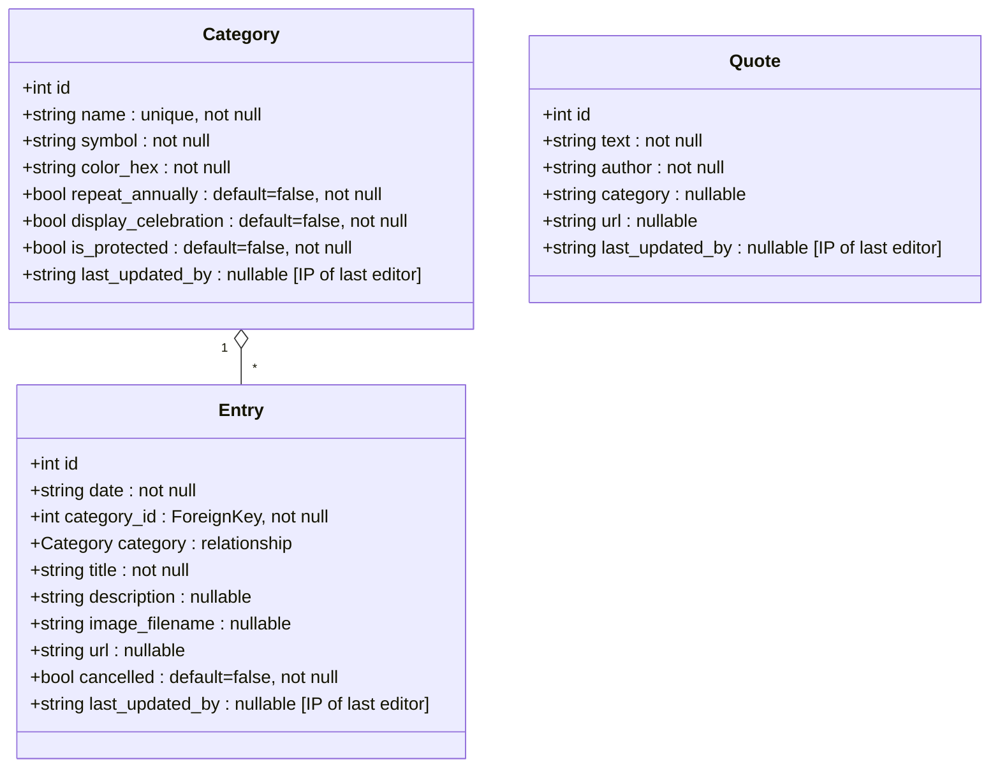

# Calendarium

This is a Flask-based web application designed to manage events and visualize them on a dynamic timeline. This application supports integration with Grafana for visual analytics and the Giphy API for enhanced user interaction.

## Getting Started

To get the application running locally, you have several options:

### Using Docker

```bash
docker-compose up --build
```

The app will be available at [http://127.0.0.1:5001/](http://127.0.0.1:5001/).

### Using a Development Container or Python Environment

Alternatively, you can set up a development container or any other Python environment. After setting up, start the application with the following command:

```bash
flask run --debug
```

For production, you would use Gunicorn as a WSGI server:

```bash
gunicorn -w 4 -b "127.0.0.1:5000" "app:create_app()"
```

Ensure your environment has all the necessary dependencies installed as specified in the `requirements.txt` file.

### Environment Variables

To integrate with Giphy, create a `.env` file in the project root and add the following key:

```plaintext
GIPHY_API_TOKEN=<your_giphy_api_token>
```

### Filling the App with Sample Data

To populate the application with sample data, run:

```bash
curl -X POST http://127.0.0.1:5000/batch-import -H "Content-Type: application/json" -d @testdata.json
```

## Scheduled Tasks

### Task Configuration

- **Purge Old Entries**
  - Set to automatically execute at the start of each month.
- **Update Serial Entries**
  - Scheduled to run at the start of every new year.

These tasks use the APScheduler, with the scheduler API enabled for enhanced interaction through HTTP endpoints. More details and the API can be accessed here: [APScheduler API Documentation](https://viniciuschiele.github.io/flask-apscheduler/rst/api.html).

## API Endpoints

Below are the available API endpoints with their respective usage:

- **Home**
  - **GET** `/`
  - Returns the main page of the application.

- **Timeline**
  - **GET** `/timeline?timeline-height=<height>&font-family=<font>&font-scale=<scale>&categories=<category_names>&max-past-entries=<number>`
  - Displays a timeline of all entries. Supports the following optional query parameters:
    - `timeline-height`: Sets the CSS height of the timeline.
    - `font-family`: Specifies the font used.
    - `font-scale`: Applies a scaling factor to the font sizes.
    - `categories`: Comma-separated list of category names to filter entries.
    - `max-past-entries`: Limits the number of past entries displayed (only the most recent past entries up to this number are shown).
  - **Example:**
    ```
    /timeline?timeline-height=100%&font-family=Arial&font-scale=1.5&categories=Cake,Birthday&max-past-entries=5
    ```
    This renders a timeline using Arial font scaled by 1.5, filtering to show only entries under “Cake” and “Birthday” categories and including at most the last five past entries.

- **Create Entry**
  - **POST** `/create`
  - Creates a new entry. Requires form data including `date`, `category`, `title`, and `description`.

- **Update Entry**
  - **GET/POST** `/update/<int:id>`
  - Retrieves an entry for editing or updates an entry if POST method is used.

- **Delete Entry**
  - **POST** `/delete/<int:id>`
  - Deletes an entry by ID.

- **Toggle Entry Cancellation**
  - **POST** `/toggle_canceled/<int:id>`
  - Toggles the cancellation status of an entry by ID. The route changes the `cancelled` state of the entry to either `True` or `False` depending on its current state. A successful operation will redirect back to the main page, updating the entry's status in the view.

- **API Data Access**
  - **GET** `/api/data`
  - Returns all entries in JSON format, including additional attributes such as `date_formatted` and `index` which help in sorting and formatting entries relative to the current date.

- **Export Data**
  - **GET** `/export-data`
  - Exports all entries and associated images as a zip file.

- **Batch Import**
  - **POST** `/batch-import`
  - Imports a batch of entries from a JSON file. *Note: This endpoint now also processes quotes.*

- **Update Serial Entries**
  - **POST** `/update-serial-entries`
  - Updates all entries linked to categories that are set to repeat annually, adjusting their dates to the current year.

- **Purge Old Entries**
  - **POST** `/purge-old-entries`
  - Deletes all entries where the date is in the past and the category is not marked as protected.

## Quote Management

The application now includes full quote management functionality. Quotes can be managed via dedicated API endpoints as well as through an integrated admin interface.

### Quote API Endpoints

- **View and Manage Quotes**
  - **GET** `/quotes/`
  - Returns an HTML page displaying all quotes along with a form to add a new quote.

- **Create Quote**
  - **POST** `/quotes/create`
  - Creates a new quote. Requires form data including:
    - `text`: The quote content.
    - `author`: The author of the quote.
    - `category`: The category of the quote (optional)
    - `url`: A URL reference (optional)

- **Update Quote**
  - **POST** `/quotes/edit/<int:id>`
  - Updates an existing quote with the provided ID. Accepts form data with new values for `text` and `author`.

- **Delete Quote**
  - **POST** `/quotes/delete/<int:id>`
  - Deletes the quote with the specified ID.

- **Current Week Quote API**
  - **GET** `/quotes/weekly`
  - Returns a JSON response containing a randomly selected quote. The quote selection is consistent for a given week (using the calendar week as a seed), ensuring that the "current quote" remains the same throughout the week.
  - Optional query parameter:
    - `category`: Filter quotes by category. Multiple categories can be specified as comma-separated values (e.g., `?category=inspiration,motivation`)

- **Current Day Quote API**
  - **GET** `/quotes/daily`
  - Returns a JSON response containing a randomly selected quote. The quote selection is consistent for a given day (using the day as a seed), ensuring that the "current quote" remains the same throughout the day.
  - Optional query parameter:
    - `category`: Filter quotes by category. Multiple categories can be specified as comma-separated values (e.g., `?category=inspiration,motivation`)

### Admin Interface for Quote Management

The quote management interface has been simplified into a single HTML file (accessible via `/quotes/`) which includes:
- A form at the top for adding new quotes.
- An inline editable table for updating or deleting existing quotes.
- Full-width text areas for better readability of quote text.

## Category Management

- **View and Manage Categories**
  - **GET/POST** `/categories`
  - Displays and allows management of categories including creation and update.

- **Update Category**
  - **POST** `/categories/update/<int:id>`
  - Allows updating details for a specific category by ID.

- **Delete Category**
  - **POST** `/categories/delete/<int:id>`
  - Deletes a category if it is not associated with any entries.

## Database Schema

Below is the database schema visualized using a Mermaid diagram:



## Grafana Integration

This application supports integration with Grafana through a Simple JSON Datasource, enabling Grafana to pull data for visualization purposes. Here are the endpoints provided for Grafana:

### Grafana Endpoint Descriptions

- **Test Connection** (`GET /grafana/`)
  - Confirms the data source connection is functional.

- **Search** (`POST /grafana/search`)
  - Returns a list of categories that can be queried (e.g., 'cake', 'birthday').

- **Query** (`POST /grafana/query`)
  - Retrieves timeseries data based on specified categories.

- **Annotations** (`POST /grafana/annotations`)
  - Delivers event annotations for graph overlays based on specific queries.

- **Tag Keys** (`POST /grafana/tag-keys`)
  - Provides tag keys for Grafana's ad hoc filtering capabilities.

- **Tag Values** (`POST /grafana/tag-values`)
  - Supplies values for the selected tag keys for further filtering.

### Example Usage

Query Grafana for timeseries data in the 'cake' category using this `curl` command:

```bash
curl -X POST http://127.0.0.1:5000/grafana/query -H "Content-Type: application/json" -d '{"targets":[{"target": "Cake", "type": "timeserie"}]}'
```

This command will return timeseries data points for the 'cake' category if such data exists. Ensure the Grafana Simple JSON Datasource plugin is installed and properly configured to interact with these endpoints.

## Giphy Integration

The Calendarium application features integration with the Giphy API to enhance the user interface with dynamic content. There are two different implementations of this integration, tailored to different deployment environments and security concerns.

### Direct Backend Integration (Original Version)

In environments where the backend server has internet access, the application can directly interact with the Giphy API. This method involves the backend making API requests to Giphy and securely managing the API key via environment variables.

- **Endpoint**: `/search_gifs`
- **Method**: `GET`
- **Function**: This endpoint takes a search query as a parameter, directly calls the Giphy API, and returns the GIF data. This keeps the API key secure and not exposed to the client-side.

Example usage:
```bash
curl http://127.0.0.1:5000/search_gifs?q=cats
```
This implementation is found in the JavaScript file `search_gifs.js`.

### Proxied API Integration (New Version)

For environments where the backend does not have direct internet access, we employ a proxied approach. Here, the backend generates a URL with the API key, which is then used by the frontend to make the Giphy API call. This method ensures that the API key is not exposed in the client-side code.

- **Backend Endpoint**: `/get-giphy-url`
- **Method**: `GET`
- **Function**: This endpoint constructs the request URL including the API key and returns it to the client. The client then uses this URL to fetch GIF data directly from Giphy.

Example usage:
```bash
curl http://127.0.0.1:5000/get-giphy-url?q=cats
```
This implementation is located in the JavaScript file `search_gifs_proxied.js`.

These methods are designed to accommodate different network security policies while maintaining functionality and protecting sensitive information.

## Flickity License Information

This project uses Flickity, which is licensed under the GPLv3.

As such, modifications to the Flickity source code used in this project are documented in the repository. To comply with the GPLv3, all source code for this application is available under the same license. The full license text is included in the LICENSE file in this repository.

## Icon Attribution

This project uses the icon "cracked glass" by Olena Panasovska from [Noun Project](https://thenounproject.com/icon/cracked-glass-3292568/) licensed under [CC BY 3.0](https://creativecommons.org/licenses/by/3.0/). To meet the attribution requirements, this link points directly to the icon's detail page. Please refer to the Noun Project's guidelines for detailed information on how to properly attribute the creator in different formats and mediums.

## Docker Image

Instead of Docker Hub, this project's Docker images are now built and pushed through GitHub Actions to the GitHub Container Registry.